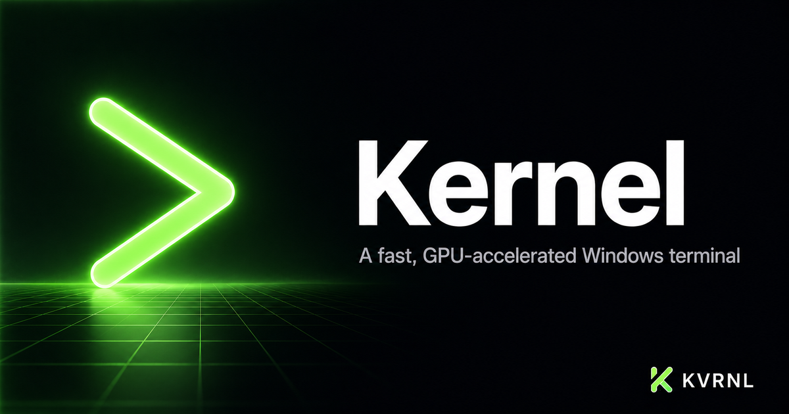

# Kernel

### A fast, GPU-accelerated Windows terminal

 

Real shells (PowerShell, Command Prompt, Git Bash, WSL) with an always-available bundled Bash, GPU rendering, and one-click profiles for AI coding CLIs like Claude, Codex, and Gemini. A terminal that actually looks and feels good.

### **[⬇&nbsp; Download Kernel — free at kvrnl.io](https://kvrnl.io/products/kernel/)**

 

---

## What it does

Kernel is KVRNL's own terminal — the studio's namesake. It runs real Windows shells over ConPTY (PowerShell, Command Prompt, Git Bash, WSL) with GPU-accelerated rendering, clickable links, search, and a clean, configurable look. Bash always works, even on a fresh machine, thanks to a bundled Bash environment.

It's also built for AI-assisted work: when you have Claude Code, Codex, or Gemini installed, Kernel offers them as one-click profiles and renders their full-screen interfaces perfectly. Right-click any folder to “Open Kernel here.” Themes, fonts, cursor, and opacity are all yours to tune. Free to use; claim your license key and download it straight from this page.

## Features

- **GPU-accelerated rendering with real ConPTY shells**
- **Auto-detected profiles + a bundled Bash so bash always works**
- **One-click AI CLI profiles — Claude, Codex, Gemini**
- **Clickable links, find, themes, fonts, opacity & “Open Kernel here”**

## Download &amp; install

Kernel is **completely free**. Each install needs its own license key, which you get
with a free KVRNL account.

1. Go to **[kvrnl.io/products/kernel/](https://kvrnl.io/products/kernel/)**
2. Create a free account — email verification, nothing else
3. Claim your license key — instant, no waiting
4. Download and install

> [!NOTE]
> Kernel isn't code-signed yet, so Windows SmartScreen may warn you on first run.
> Click **More info → Run anyway**. Code signing is on the roadmap.

## Your license key

- **Free, one per product**, issued from your KVRNL account.
- **A key activates on one machine.** The first device to activate it claims it.
- **Switching computers?** Hit **Release device** on your
  [account page](https://kvrnl.io/account/) and the key is free to use again.
- Keys are checked over HTTPS at launch. See [Privacy](#privacy).

## Requirements

- **Windows 10 or 11** (64-bit)
- A free [KVRNL account](https://kvrnl.io/signup/) for your license key

## Privacy

Kernel sends KVRNL only what's needed to validate your license: **the key, the
product name, and a hardware ID**. No telemetry, no analytics, no tracking, and
none of your files. Full policy: **[kvrnl.io/privacy](https://kvrnl.io/privacy/)**

## What's new

**v1.0.26** — 2026-09-25
  - Kernel's routine license check now also says which version you're running and whether Kernel just started. That helps us see that updates are reaching everyone and spot misuse of license keys.
  - Nothing you type or run in Kernel is ever sent. Only the license check itself.

**v1.0.25** — 2026-09-25
  - Stronger tamper protection. Kernel now checks its own files every time it starts, and won't run if they've been modified.
  - Kernel can no longer be started in debugging mode, closing off one more way around activation.

**v1.0.24** — 2026-09-25
  - Brand-new activation screen with clear, step-by-step instructions for getting your free key. Each step has a button that takes you straight to the right page on kvrnl.io.
  - New Paste button, and keys are tidied up for you. Extra spaces, line breaks or punctuation copied along with your key no longer cause a "key not found" error.
  - Every activation message now tells you exactly what to do next, like releasing your key from another PC, with a button to get there.
  - Tighter license protection. Kernel stays fully locked until it's activated, and an offline license can no longer be copied to another PC or stretched past its grace period.
  - Opening Kernel again while the activation screen is up now brings that screen to the front, instead of seeming to do nothing.

**v1.0.23** — 2026-09-05
  - A hiccup on our license server no longer locks you out. If the server is having a bad moment, Kernel now treats it like being offline and keeps working, instead of showing an activation screen for a key that's perfectly fine.
  - Pressing Esc in the search box now actually closes it. Before, it closed and immediately reopened.
  - Closing Settings hands the keyboard straight back to the terminal, so you can keep typing without clicking first.
  - The maximize button now shows whether the window is maximized or not, and flips between maximize and restore.
  - Smoother window-opacity slider, and lighter background license checks.

**v1.0.22** — 2026-08-18
  - Downloads and automatic updates now come straight from KVRNL's own servers instead of a third-party host. Updates are quicker and more reliable, and nothing inside the app itself has changed.
  - If you installed this app before today, please download it once more from kvrnl.io. Older copies still look for updates at the old location and can't carry themselves across the move — this one time has to be done by hand.

Full history → **[kvrnl.io/changelog/kernel](https://kvrnl.io/changelog/kernel/)**

## Documentation

Setup guides and how-tos → **[kvrnl.io/docs/kernel](https://kvrnl.io/docs/kernel/)**

## Support

> [!IMPORTANT]
> **We don't use GitHub Issues.** Report bugs from inside the app — it's the
> fastest route to us and it attaches the details we need automatically.

- 🐛 **Found a bug?** Use **Report a Problem** inside Kernel
- 💬 **Chat with us** → **[Discord](https://discord.gg/Ub4SdAuhu)**
- ✉️ **Anything else** → **[kvrnl.io/contact](https://kvrnl.io/contact/)**
- ❓ **FAQ** → [kvrnl.io/faq](https://kvrnl.io/faq/)

## License

**Proprietary freeware — free to use, not open source.**

This repository hosts the installer releases, documentation, and license for
Kernel. **The application source code is not published.** See
**[LICENSE](./LICENSE)** for the full terms.

---

 

**[kvrnl.io](https://kvrnl.io)** &nbsp;·&nbsp; **[All products](https://kvrnl.io/products/)** &nbsp;·&nbsp; **[Changelog](https://kvrnl.io/changelog/)** &nbsp;·&nbsp; **[Discord](https://discord.gg/Ub4SdAuhu)** &nbsp;·&nbsp; **[Contact](https://kvrnl.io/contact/)**

© 2026 <b>KVRNL</b> — an AI-powered software studio shipping free desktop tools.

